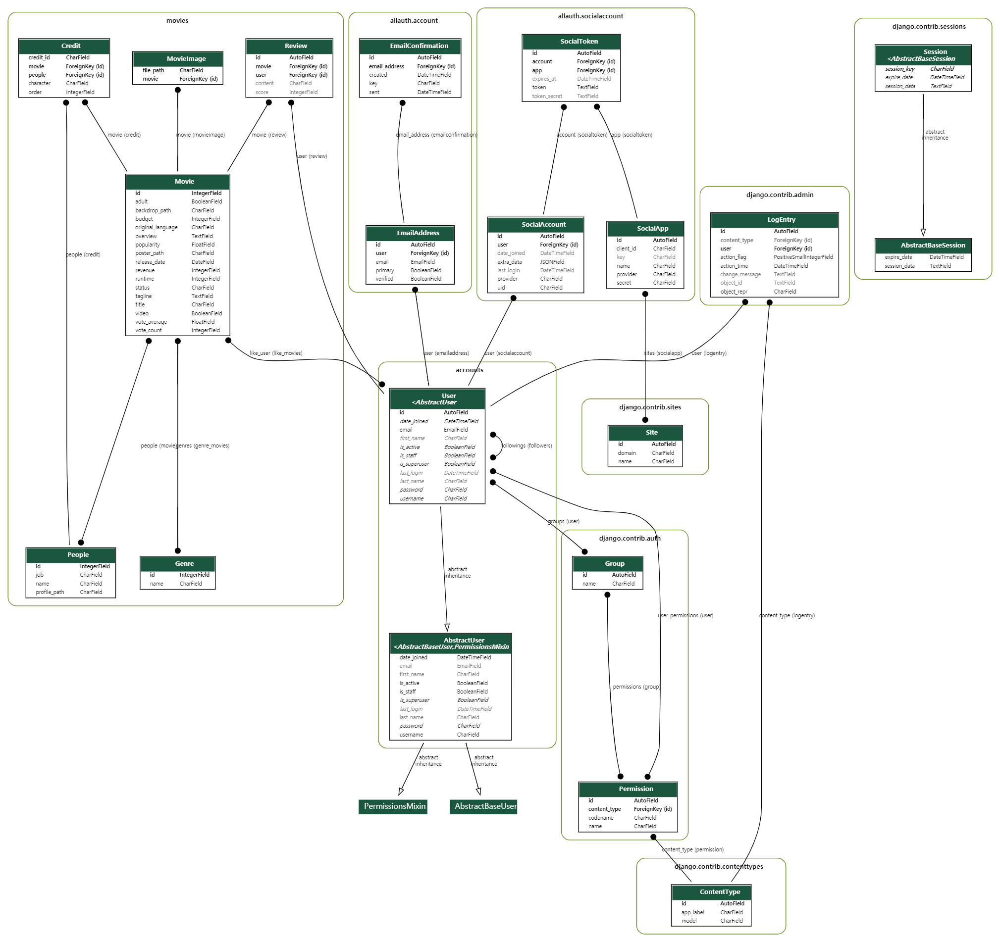

[](https://www.jsdelivr.com/package/npm/jwt-decode)

# Inspiration

Inspiration is a Django application for make up with movie recommendations.

영감은 영화 추천을 위해 만든 장고 어플리케이션입니다.

### ⅰ) 팀원 정보 및 업무 분담 내역 (Teams and Works)

* 이 경호

  * UI 개발 위주
  * Javascript가 필요한 로직
  * accounts / rater 앱 제작
  * 인터페이스 로직 제작a

  

*  [이 승열](https://github.com/Ssong10)
  * 데이터 및 핵심 로직 구현
  * 장고 orm 쿼리 관리 
  * 관리자 페이지// 개발용 페이지 구현 관리
  * 리뷰 작성 컴포넌트 제작


### ⅱ) 목표 서비스 구현 및 실제 구현 정도 (Our Goal)

*  초기 목표
  * 완전 반응형 웹사이트.
  * 영화추천, 별점 리뷰, 협업 필터링 기반 추천 시스템, 사용자 친화적인 인터페이스 구현
* 달성한 목표
  * 초기 목표 달성
  * 개발 중에 게이미피케이션 적용한 평가 기능을 추가하기로 하였고 추가 완료
* 실패한 목표
  * 영화마다 다른 파비콘(Favicon) 적용 
  * 위키 백과 등 웹 파싱으로 배우나 영화의 상세정보 출력 (시간 부족)

### ⅲ) 데이터베이스 모델링(ERD)



> powered by graphviz 

> [Graphviz]( https://www.graphviz.org/ )


### ⅳ) 핵심 기능 (Functions)

#### 협업 필터링 기반 영화 추천 시스템


#### 파도타기 기능


#### 빠른 평가 기능


### ⅴ) 배포 서버 URL 

#### [영감, Inspiration 배포 URL](http://15.165.19.28/ )


### ⅵ) 기타 (Others)


## Installation

Clone this.

You can find dependencies on requirements.txt

write, 

```bash
$ pip install -r requirements.txt
```


Our Initial DB is in `Fixtures` directory.

It has `500+` pre-made user data & 700+ movie data.

All of our movie data comes from [The Movie DB](https://www.themoviedb.org/)


## Usage

We'll deploy it on AWS or Heroku. So you can get it.


# About Project

### 1. ERD

Look Above


### 2. Interfaces


### 3. Recommendation Algorithm

### `Collaborative Filtering Recommendation System`

> **Collaborative filtering** (**CF**) is a technique used by [recommender systems](https://en.wikipedia.org/wiki/Recommender_system).[[1\]](https://en.wikipedia.org/wiki/Collaborative_filtering#cite_note-handbook-1) Collaborative filtering has two senses, a narrow one and a more general one.[[2\]](https://en.wikipedia.org/wiki/Collaborative_filtering#cite_note-recommender-2)
>
> In the newer, narrower sense, collaborative filtering is a method of making automatic [predictions](https://en.wikipedia.org/wiki/Prediction) (filtering) about the interests of a [user](https://en.wikipedia.org/wiki/End_user) by collecting preferences or [taste](https://en.wikipedia.org/wiki/Taste_(sociology)) information from [many users](https://en.wikipedia.org/wiki/Crowdsourcing) (collaborating). The underlying assumption of the collaborative filtering approach is that if a person *A* has the same opinion as a person *B* on an issue, A is more likely to have B's opinion on a different issue than that of a randomly chosen person. For example, a collaborative filtering recommendation system for [television](https://en.wikipedia.org/wiki/Television) tastes could make predictions about which television show a user should like given a partial list of that user's tastes (likes or dislikes).[[3\]](https://en.wikipedia.org/wiki/Collaborative_filtering#cite_note-3) Note that these predictions are specific to the user, but use information gleaned from many users. This differs from the simpler approach of giving an [average](https://en.wikipedia.org/wiki/Average) (non-specific) score for each item of interest, for example based on its number of [votes](https://en.wikipedia.org/wiki/Vote).
>
> In the more general sense, collaborative filtering is the process of filtering for information or patterns using techniques involving collaboration among multiple agents, viewpoints, data sources, etc.[[2\]](https://en.wikipedia.org/wiki/Collaborative_filtering#cite_note-recommender-2) Applications of collaborative filtering typically involve very large data sets. Collaborative filtering methods have been applied to many different kinds of data including: sensing and monitoring data, such as in mineral exploration, environmental sensing over large areas or multiple sensors; financial data, such as financial service institutions that integrate many financial sources; or in electronic commerce and web applications where the focus is on user data, etc. The remainder of this discussion focuses on collaborative filtering for user data, although some of the methods and approaches may apply to the other major applications as well
>
> -By Wikipedia


