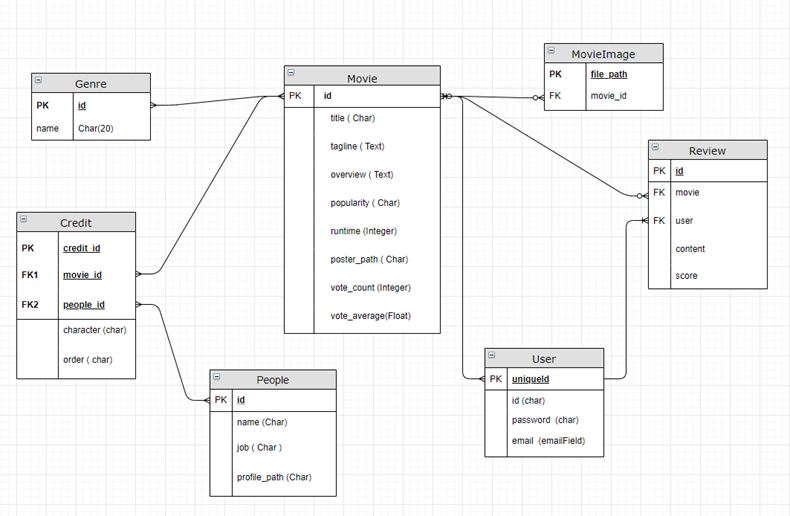

[](https://www.jsdelivr.com/package/npm/jwt-decode)

# Inspiration

Inspiration is a Django application for make up with movie recommendations.

영감은 영화 추천을 위해 만든 장고 어플리케이션입니다.

### ⅰ) 팀원 정보 및 업무 분담 내역 (Teams and Works)

* [이 경호](https://github.com/dodonmountain)

  * UI 개발
  * Javascript가 필요한 로직
  * accounts / rater 서브 앱 제작
  * 인터페이스

  

*  [이 승열](https://github.com/Ssong10) [Github Link]
  
  * 데이터 및 핵심 로직 구현
  * 장고 orm 쿼리 관리 
  * 관리자 페이지// 개발용 페이지 구현 관리
  * 리뷰 작성 컴포넌트 제작


### ⅱ) 목표 서비스 구현 및 실제 구현 정도 (Our Goal)

*  초기 목표
  * 완전 반응형 웹사이트.
  * 영화추천, 별점 리뷰, 협업 필터링 기반 추천 시스템, 사용자 친화적인 인터페이스 구현
  * ~~__Buy me a coffee__링크 적용~~
  * 프로젝트 평가 1등
  * 주 120시간 근무 __`축 달성`__


* 달성한 목표
  * 초기 목표 달성
  * 개발 중에 게이미피케이션 적용한 평가 기능을 추가하기로 하였고 추가 완료


* 실패한 목표
  * 영화마다 다른 파비콘(Favicon) 적용 
  * 위키 백과 등 웹 파싱으로 배우나 영화의 상세정보 출력
  * 외부 라이브러리 이용 없이 스와이프/드래그 가능한 Carousel 구현
  * 누구나 사용할 수 있는 직관적인 인터페이스 구성 
  * 모바일 대응도 간신히. 기능 절반이상 모바일에서 사용불가.


### ⅲ) 데이터베이스 모델링(ERD)


> powered by graphviz 

> [Graphviz]( https://www.graphviz.org/ )



* `Movie` 테이블을 중심으로 구성.
  * Movie 오브젝트를 호출하여 related 관계에 있는 `Genre`, `MovieImage`, `Review`, `Credit`등 정보 표시에 필요한 데이터에 쉽게 접근할 수 있도록 구성.
  * `TMDB`에서 제공하는 API를 호출하고, 그 중 `Inspiration` 에 필요한 데이터를 선별적으로 Fixture로 저장하여 개발에 활용.
  * User 테이블은 특정한 성향을 지닌 fake user 오브젝트를 가지고 있다. 
  * 이를 이용하여 35000+ 개의 Review 오브젝트를 생성하고 이들을 가상의 데이터로 활용하여 협업 필터링 추천 시스템을 구현하였다.


### ⅳ) 핵심 기능 (Functions)

#### 협업 필터링 기반 영화 추천 시스템

> movies/ views.py

향후 추가 예정 ( 하단 영문 부분 위키백과 설명 있음 )


#### 파도타기 기능

> detail.html / actor.html

케빈 베이컨의 6단계 게임을 구현하려고 했으나, DB 확보의 한계로 간단한 파도타기 기능을 구현.

송강호나 이경영 배우가 출연한 영화를 고르면 6단계 안에 한국 영화인 전부를 만나는 것도 가능할지도.


#### 빠른 평가 기능

> rater.js / rater.html

초기 유저의 평가가 없으면 성립할 수 없는 협업 필터링 알고리즘의 단점을 효과적으로 보완하고자, 

간단한 미니 게임 형식의 평가를 유도하였다. 숫자패드 1~0까지를 각각의 별점으로 환산, 15개를 적절한 시간안에 평가하도록 하여 초기 자료를 확보하고 초기 추천 목록을 계산할 수 있게 하였다.


### ⅴ) 배포 서버 URL 

#### [영감, Inspiration 배포 URL](http://15.165.19.28/ )


### ⅵ) 기타 (Others)

* 협업 도구는 `Github` 과 `Slack` 만을 사용.
* `Collaborator` 등록으로 하나의 원격 저장소를 사용하여 개발.
* 기본적으로 개발하는 영역을 철저히 분리했기에 conflict 발생은 거의 없었다.
* Front-End framework 사용 없이 순수 Django로만 개발했는데, 초기의 개발 속도에서는 설정등의 간편함으로 확실히 장점이 있지만, `Vue.js` 나 `React.js`의 방대한 라이브러리를 활용하지 못해서 바닐라 자바스크립트와 css 트릭으로만 뷰를 구성해야하는 난점이 있었다.


## Installation

Clone this.

You can find dependencies on requirements.txt

write, 

```bash
$ pip install -r requirements.txt
```

```bash
// requiremens.txt
// You can copy & paste below. Or just use the command above.

certifi==2019.9.11
chardet==3.0.4
defusedxml==0.6.0
dj-database-url==0.5.0
Django==2.2.7
django-allauth==0.40.0
django-heroku==0.3.1
gunicorn==20.0.4
idna==2.8
numpy==1.17.4
oauthlib==3.1.0
psycopg2==2.8.4
python-decouple==3.3
python3-openid==3.1.0
pytz==2019.3
requests==2.22.0
requests-oauthlib==1.3.0
sqlparse==0.3.0
urllib3==1.25.7
whitenoise==4.1.4

```


Our Initial DB is in `Fixtures` directory.

It has `500+` pre-made user data & 700+ movie data.

All of our movie data comes from [The Movie DB](https://www.themoviedb.org/)


## Usage

We'll deploy it on AWS . So you can get it.

### [Inspiration Deploy URL](http://15.165.19.28/ )


# About Project

### 1. ERD

 

### 2. Interfaces


### 3. Recommendation Algorithm

### `Collaborative Filtering Recommendation System`

> **Collaborative filtering** (**CF**) is a technique used by [recommender systems](https://en.wikipedia.org/wiki/Recommender_system).[[1\]](https://en.wikipedia.org/wiki/Collaborative_filtering#cite_note-handbook-1) Collaborative filtering has two senses, a narrow one and a more general one.[[2\]](https://en.wikipedia.org/wiki/Collaborative_filtering#cite_note-recommender-2)
>
> In the newer, narrower sense, collaborative filtering is a method of making automatic [predictions](https://en.wikipedia.org/wiki/Prediction) (filtering) about the interests of a [user](https://en.wikipedia.org/wiki/End_user) by collecting preferences or [taste](https://en.wikipedia.org/wiki/Taste_(sociology)) information from [many users](https://en.wikipedia.org/wiki/Crowdsourcing) (collaborating). The underlying assumption of the collaborative filtering approach is that if a person *A* has the same opinion as a person *B* on an issue, A is more likely to have B's opinion on a different issue than that of a randomly chosen person. For example, a collaborative filtering recommendation system for [television](https://en.wikipedia.org/wiki/Television) tastes could make predictions about which television show a user should like given a partial list of that user's tastes (likes or dislikes).[[3\]](https://en.wikipedia.org/wiki/Collaborative_filtering#cite_note-3) Note that these predictions are specific to the user, but use information gleaned from many users. This differs from the simpler approach of giving an [average](https://en.wikipedia.org/wiki/Average) (non-specific) score for each item of interest, for example based on its number of [votes](https://en.wikipedia.org/wiki/Vote).
>
> In the more general sense, collaborative filtering is the process of filtering for information or patterns using techniques involving collaboration among multiple agents, viewpoints, data sources, etc.[[2\]](https://en.wikipedia.org/wiki/Collaborative_filtering#cite_note-recommender-2) Applications of collaborative filtering typically involve very large data sets. Collaborative filtering methods have been applied to many different kinds of data including: sensing and monitoring data, such as in mineral exploration, environmental sensing over large areas or multiple sensors; financial data, such as financial service institutions that integrate many financial sources; or in electronic commerce and web applications where the focus is on user data, etc. The remainder of this discussion focuses on collaborative filtering for user data, although some of the methods and approaches may apply to the other major applications as well
>
> -By Wikipedia


